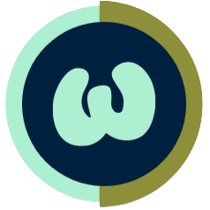

#  WorkSpacing – Personal & Team Workspace Management

 **Live Demo:** [WorkSpacing](https://workspacing.vercel.app)

---

## WorkSpacing – Your All-in-One Productivity Hub

WorkSpacing is a powerful web-based **task & content management** platform for individuals and teams. With an intuitive interface and **AI-powered task generation**, WorkSpacing helps you stay organized and collaborate seamlessly.
If you're interested, please refer to this link to know the backstory of this project [Workspacing blog post](https://nhung-portfolio.vercel.app/blog/workspacing-from-ideas-to-actual-product-1751472101998)

---

##  Key Features

###  Personal Workspace
- **Task Management**: Add, edit, delete tasks with status tracking (In Progress / Done / Cancel).  
- **Content Management**: Organize notes, documents, and other content.  
- **Visual Task Overview**: Status bar for tracking daily tasks.  
- **Category Filtering**: Group content into categories for easy access.  

### Teamspaces (Collaboration)
- **Kanban Boards**: Create & manage boards, add columns & tasks.  
- **AI Task Generation**: Automatically generate tasks & columns with AI.
- **Manage tasks**: Update task related information, embed teamspace content, assign to a member
- **Due Dates & Personal Task Sync**: Link team tasks to personal workspace. 
- **Activity Logs**: Track changes to tasks in real time.  
- **Shared Content**: Manage team documents just like personal content.  

### Security & Access Control
- **Google Authentication** with Clerk  
- **Role-based Permissions (Coming Soon!)**  
- **Data Privacy & Secure Workspaces**  

---

## Getting Started

1. **Sign Up / Log In**  
   Create an account using **Google authentication**.  
2. **Set Up Your Workspace**  
   - Add **tasks & content** to your personal space.  
   - Organize everything efficiently.  
3. **Join or Create a Teamspace**  
   - Work with your team on **Kanban boards & shared content**.  
   - Use **AI-powered task suggestions** to boost productivity.  

---

## Roadmap & Future Enhancements
✔ AI-powered **task suggestions & smart notifications**  
✔ **Granular permissions & role-based access control**  
✔ **Mobile-friendly UI & PWA support**  
✔ **Calendar & external app integrations**  

---

## Support & Feedback
Have questions or suggestions? Let’s connect!  
Email: [nguyennhungforwork04@gmail.com](mailto:nguyennhungforwork04@gmail.com)  

---

### Try WorkSpacing Now!  
 [Live Demo](https://workspacing.vercel.app)  
