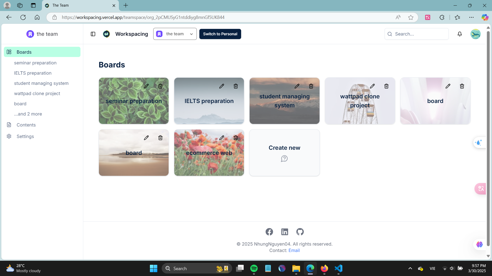

#  WorkSpacing – Personal & Team Workspace Management

🚀 **Live Demo:** [WorkSpacing](https://workspacing.vercel.app)

---

## ✨ WorkSpacing – Your All-in-One Productivity Hub

WorkSpacing is a powerful web-based **task & content management** platform for individuals and teams. With an intuitive interface and **AI-powered task generation**, WorkSpacing helps you stay organized and collaborate seamlessly.

---

## 🔥 Key Features

### 🏠 Personal Workspace
- **✅ Task Management**: Add, edit, delete tasks with status tracking (In Progress / Done / Cancel).  
- **📂 Content Management**: Organize notes, documents, and other content.  
- **📊 Visual Task Overview**: Status bar for tracking daily tasks.  
- **🗂️ Category Filtering**: Group content into categories for easy access.  

### 👥 Teamspaces (Collaboration)
- **🗂 Kanban Boards**: Create & manage boards, add columns & tasks.  
- **⚡ AI Task Generation**: Automatically generate tasks & columns with AI.  
- **📅 Due Dates & Personal Task Sync**: Link team tasks to personal workspace.  
- **📝 Activity Logs**: Track changes to tasks in real time.  
- **📂 Shared Content**: Manage team documents just like personal content.  

### 🔒 Security & Access Control
- **🔑 Google Authentication** with Clerk  
- **🛡️ Role-based Permissions (Coming Soon!)**  
- **🌍 Data Privacy & Secure Workspaces**  

---

## 🚀 Getting Started

1. **Sign Up / Log In**  
   Create an account using **Google authentication**.  
2. **Set Up Your Workspace**  
   - Add **tasks & content** to your personal space.  
   - Organize everything efficiently.  
3. **Join or Create a Teamspace**  
   - Work with your team on **Kanban boards & shared content**.  
   - Use **AI-powered task suggestions** to boost productivity.  

---

## 🌱 Roadmap & Future Enhancements
✔ AI-powered **task suggestions & smart notifications**  
✔ **Granular permissions & role-based access control**  
✔ **Mobile-friendly UI & PWA support**  
✔ **Calendar & external app integrations**  

---

## 🤝 Support & Feedback
Have questions or suggestions? Let’s connect!  
📧 Email: [support@workspacing.com](mailto:support@workspacing.com)  

---

### ⚡ Try WorkSpacing Now!  
👉 [Live Demo](https://workspacing.vercel.app)  
